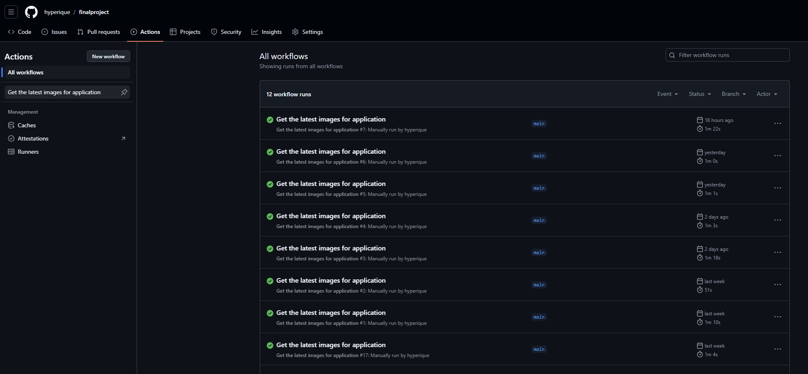
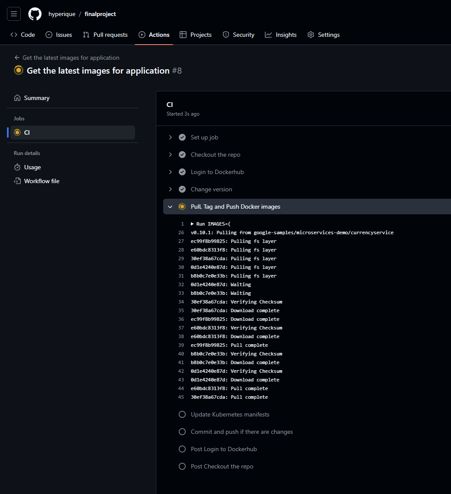
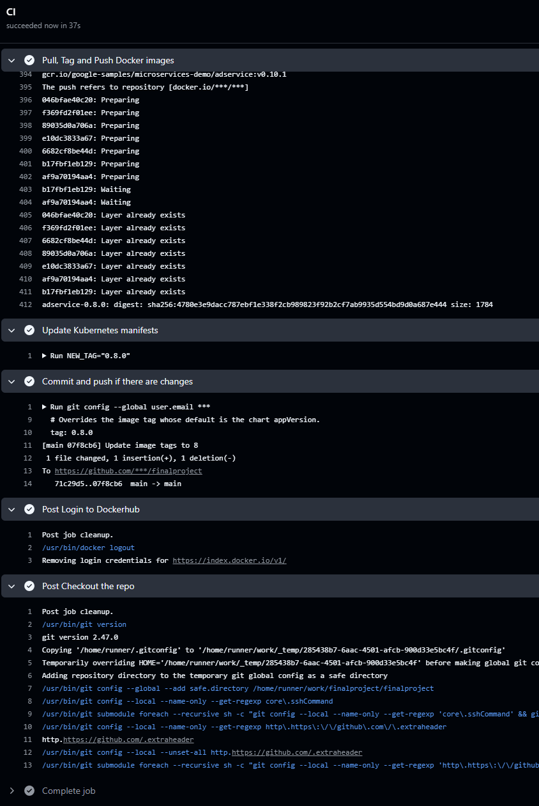

CI часть для развертывания сервисов инфраструктуры и приложения в Argo CD. (infrastructure.yml). 
Логика работы следующая: workflow подключается к менеджмент серверу k8s по SSH -> пулит из репозитория ветку main -> развертывает по порядку инфраструктурные сервисы, затем разворачивает demoshop в argo. Устанавливаются следующие компоненты:

 1. MetalLB
 2. Ingress-nginx
 3. cert manager
 4. minio operator
 5. minio tenant
 6. Grafana/prometheus/loki/promtail
 7. ArgoCD
 8. Consul
 9. Приложение demoshop.ust.inc
 

CI часть для запуска развертывания проекта demoshop, выполняет следующие задачи:

1. Скачивает образы микросервисов
2. Тэгирует их новой версией
3. Запуливает их в dockerhub
4. Меняет версию приложения в манифестах
5. Коммитит и пушит изменения

