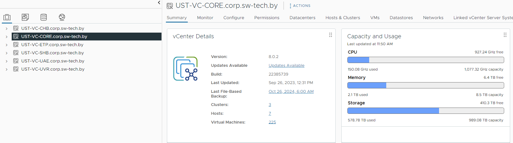
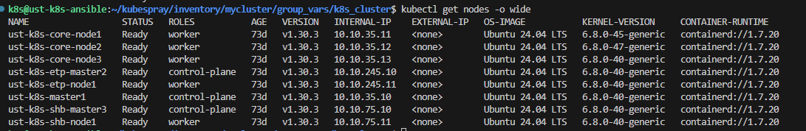

Кластер развернут с помощью kubespray в трех разных датацентрах, соединенных между собой с помощью ipsec (1gbit). Во всех датацентрах в качестве поставщиков серверов выступает виртуализация от Vmware. 

Кластер включает в себя 3 control plane (по одному на дц), и 5 worker nodes (3 в основном дц и по 1 в резервных). На всех нодах установлены идентичные ubuntu 24.04 LTS. В качестве CNI в кластере используется calico.

hosts.yaml и k8s-cluster.yaml для развертывания кластера находятся в каталоге.

