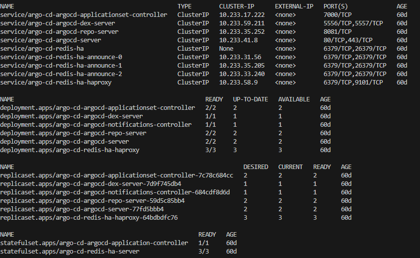

Для CD части в проекте предусмотрен ArgoCD. Выполняет следующие задачи:

1. Подключается к репозиторию проекта
2. Автоматически синхронизирует изменения в репозитории
3. Разворачивает в кластере новые версии приложений

Приложение развернуто из helm чарта ArgoCD (https://github.com/argoproj/argo-helm/)

`helm install argo-cd --namespace=argo-cd --create-namespace --values=argo-cd/valuescustom.yaml argo-cd/`

