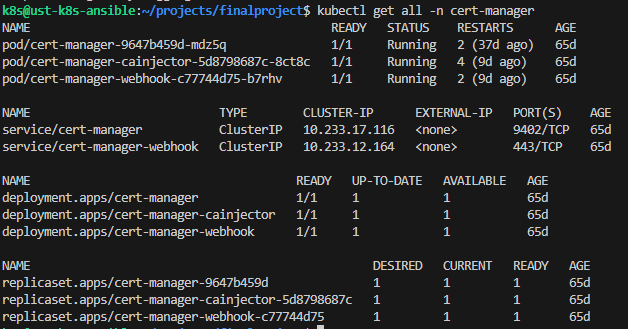

Certmanager развернут в кластере для выпуска let's encrypt сертификатов для ingress сервисов, опубликованных в проекте.

```helm repo add jetstack https://charts.jetstack.io --force-update```

```helm install cert-manager jetstack/cert-manager --namespace cert-manager --create-namespace --version v1.15.3 --set crds.enabled=true```



