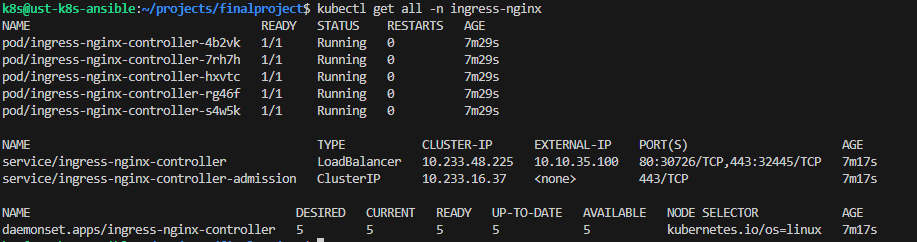

Ingress будет развернут для публикации сервисов и приложений во внешнюю сеть.

```helm install ingress-nginx ingress-nginx/ingress-nginx --version 4.11.3 --namespace=ingress-nginx --values=ingress-nginx/values.yaml```

Было принято решение развернуть ingress через DaemonSet, с включенным HostNetwork для возможности направления трафика на все worker ноды кластера (на разных площадках), не привязываясь жестко к IP балансировщика.

