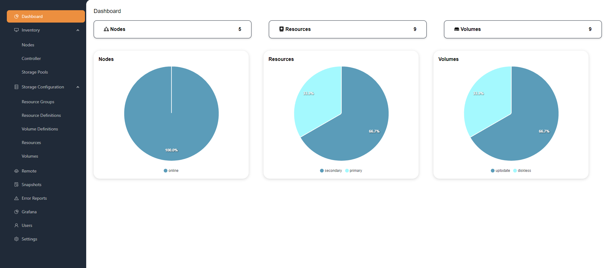

В качестве одной из подсистем хранения данных будем использовать распределенную файловую систему linstor от linbit.

Установка паралельного ssh:

`sudo apt install pdsh`

Сначала установим заголовки ядра, потому что репликация DRBD основана на модуле ядра, который должен быть создан на всех нодах:

`pdsh -w ^hosts -R ssh "apt-get install linux-headers-$(uname -r)"`

Потом добавим репозиторий ppa:

`pdsh -w ^hosts -R ssh "add-apt-repository ppa:linbit/linbit-drbd9-stack"`

`pdsh -w ^hosts -R ssh "apt-get update"`

На всех нодах установим эти пакеты:

 `pdsh -w ^hosts -R ssh "apt install drbd-utils drbd-dkms lvm2 -y"`

Загрузим модуль ядра DRBD:

`pdsh -w ^hosts -R ssh "modprobe drbd"`

Проверим, что он точно загрузился:

`pdsh -w ^hosts -R ssh "lsmod | grep -i drbd"`

 


Убедимся, что он автоматически загружается при запуске:

`pdsh -w ^hosts -R ssh "echo drbd > /etc/modules-load.d/drbd.conf"`

Кластер Linstor состоит из одного активного контроллера, который управляет всей информацией о кластере, и спутников — нод, которые предоставляют хранилище. На ноде, которая будет контроллером, выполним команду:

`apt install linstor-controller linstor-satellite linstor-client`

Эта команда делает контроллер еще и спутником. В моем случае контроллером был ust-k8s-core-linstor-node1. Чтобы сразу запустить контроллер и включить его автоматический запуск при загрузке, выполним команду:

`systemctl enable --now linstor-controller`

`systemctl start linstor-controller`

На оставшихся нодах-спутниках установим следующие пакеты:

`pdsh -w ^hostssat -R ssh "apt install linstor-controller linstor-satellite linstor-client -y"`

Запустим спутник и сделаем так, чтобы он запускался при загрузке:

`pdsh -w ^hostssat -R ssh "systemctl enable --now linstor-satellite"`
`pdsh -w ^hostssat -R ssh "systemctl start linstor-satellite"` 

Теперь можно добавить к контролеру спутники, включая саму эту ноду:

 ```
  linstor node create ust-k8s-core-node1 10.10.35.11
  linstor node create ust-k8s-core-node2 10.10.35.12
  linstor node create ust-k8s-core-node3 10.10.35.13
  linstor node create ust-k8s-shb-node1 10.10.75.11
  linstor node create ust-k8s-etp-node1 10.10.245.11

 ```

 


Проверим харды под линстор:

`pdsh -w ^hosts -R ssh "lsblk"`

Сначала подготовим физический диск или диски на каждом узле. В моем случае это /dev/sdb:


`pdsh -w ^hosts -R ssh "vgcreate k8s /dev/sdb"`


Теперь создадим «тонкий» пул для thin provisioning (то есть возможности создавать тома больше доступного места, чтобы потом расширять хранилище по необходимости) и снапшотов:

`pdsh -w ^hosts -R ssh "lvcreate -l 100%FREE --thinpool k8s_ssd/lvmthinpool"`

Пора создать пул хранилища на каждой ноде. Сделаю это только для нод с SSD дисками в моем кластере. Так что на контроллере выполняем команду:

```
linstor storage-pool create lvmthin ust-k8s-core-node1 k8s-ssd-pool k8s/lvmthinpool
linstor storage-pool create lvmthin ust-k8s-core-node2 k8s-ssd-pool k8s/lvmthinpool
linstor storage-pool create lvmthin ust-k8s-core-node3 k8s-ssd-pool k8s/lvmthinpool

```


Далее развернем linstor controller:

`kubectl apply -f linstorcontroller.yaml`


И создадим storageclass с количеством реплик 2:


Так же линстор имеет свой удобный графический интерфейс:

