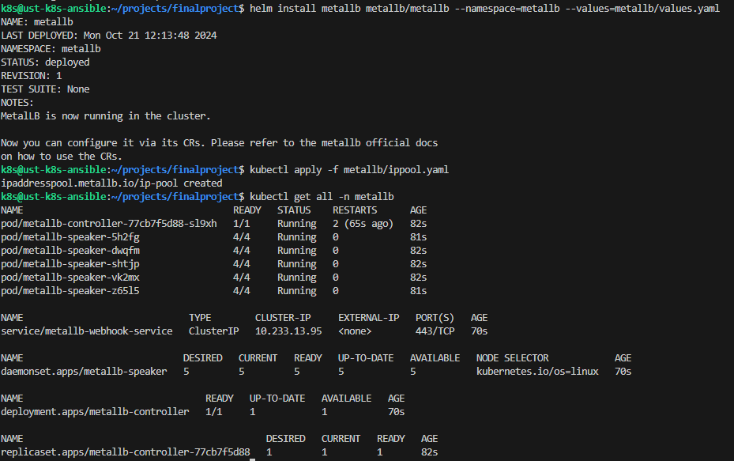

Балансировщик metallb установлен со стандартным конфигом из helm chart.

```helm install metallb metallb/metallb --namespace=metallb --values=metallb/values.yaml```

Добавим ippool:

```kubectl apply -f metallb/ippool.yaml```

