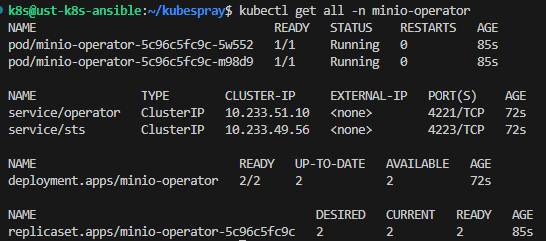
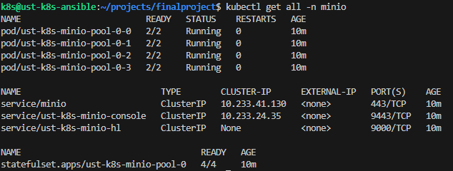

Установим minio как s3 хранилище логов loki.

1. Установим operator:

```helm repo add minio-operator https://operator.min.io```

```helm install --namespace minio-operator --create-namespace --values=minio/operator/values.yaml minio-operator minio-operator/operator```



2. Развернем tenant

 ```helm upgrade --install --namespace minio --create-namespace --values minio/values.yaml minio-k8s minio-operator/tenant```

 