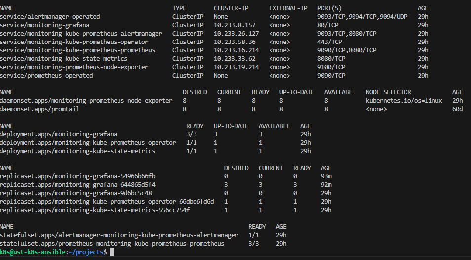
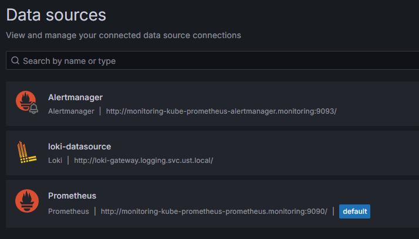
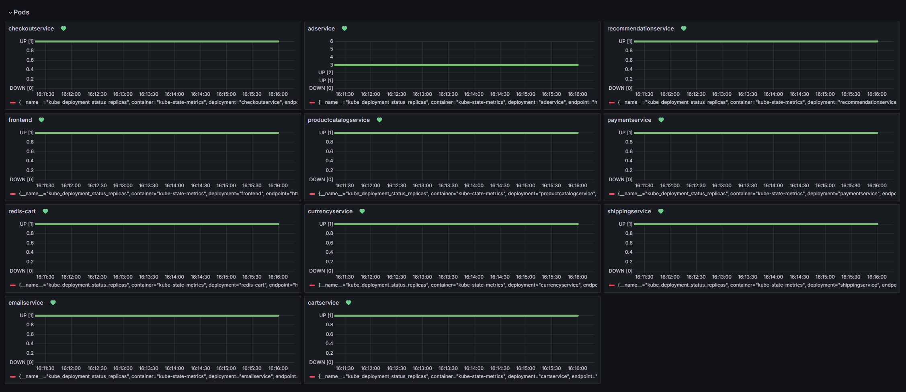
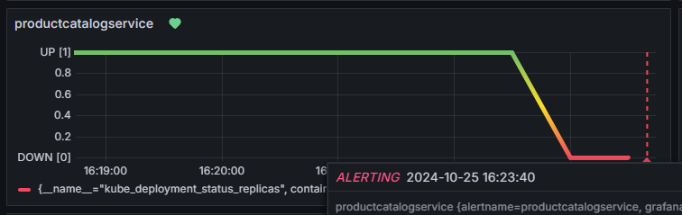
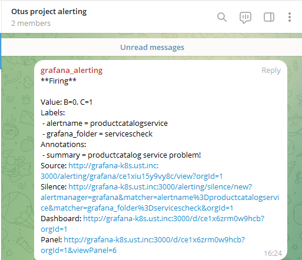
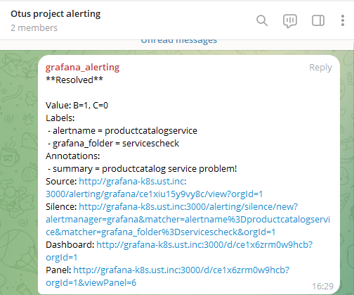

Система мониторинга из helm chart kube-prometheus-stack. Используется для мониторинга приложения и компонентов кластера. Из данного чарта устанавливаем Grafana, Prometheus и Alertmanager. Доступ к grafana можно получить по адресу: grafana-k8s.ust.inc

`helm upgrade --install monitoring prometheus-community/kube-prometheus-stack --namespace=monitoring --create-namespace --values=monitoring/grafana/values.yaml`

Datasources для grafana:

В grafana создан кастомный dashboard для наблюдения за состоянием deployments микросервисов (dashboard.yaml). В нем выведена метрика kube_deployment_status_replicas_available. В случае падения одного из микросервисов мы это увидим на графике dashboard. Так же для каждого сервиса настроен alert (alertrules.yaml), который в случае отутствия активных реплик в deployment проинформирует об этом в telegram канал. 

В случае появления >1 работающего pod в deployment мы получим сообщение о восстановлении работоспособности:

