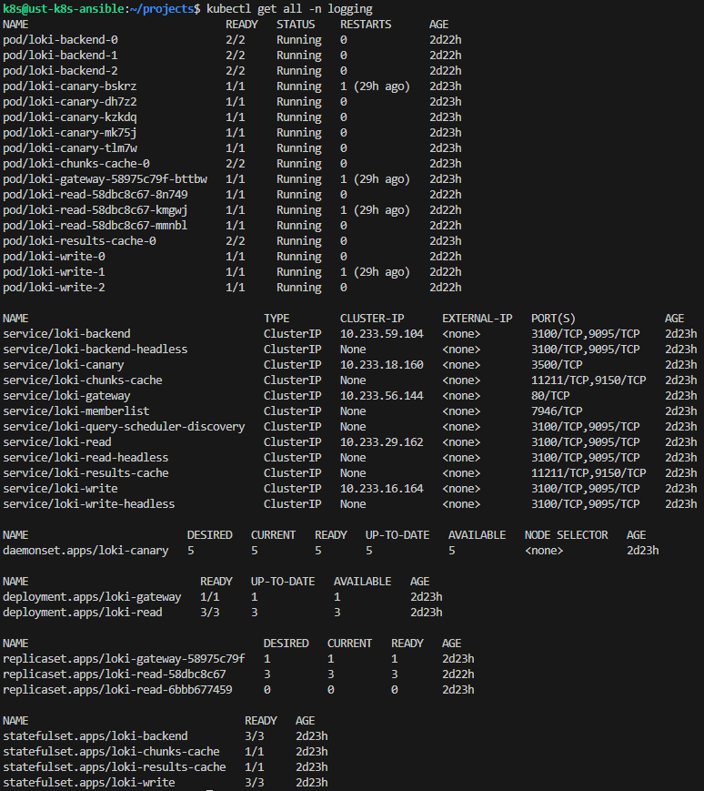

Система логирования, подключаемая к grafana, использующая в качестве s3 бэкенда self-hosted minio бакет. Тип установки - simple scalable.

` helm repo add grafana https://grafana.github.io/helm-charts`

`helm upgrade --install loki --namespace=logging --create-namespace grafana/loki --values=monitoring/loki/values.yaml`

