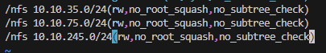
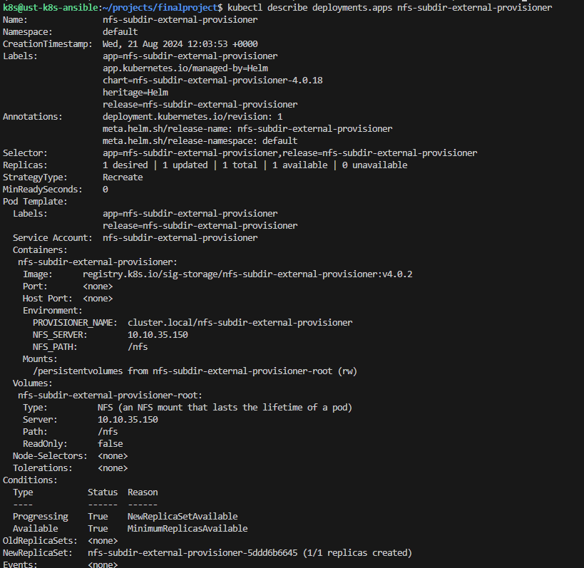

В качестве еще одного из CSI провайдеров используется NFS subdir external provisioner (https://github.com/kubernetes-sigs/nfs-subdir-external-provisioner)
1. Подготовим NFS сервер под него:

```ssh 10.10.35.150
   apt install nfs-kernel-server
   sudo vi /etc/exports
```

   - подсети кластера k8s

`sudo exportfs -a`

2. Установим provisioner, из этого чарта устанавливается storage class в кластер Kubernetes и dynamic provisioner, который динамически создает постоянные тома из одного общего ресурса NFS.

```helm repo add nfs-subdir-external-provisioner https://kubernetes-sigs.github.io/nfs-subdir-external-provisioner/

   helm install nfs-subdir-external-provisioner nfs-subdir-external-provisioner/nfs-subdir-external-provisioner     --set nfs.server=10.10.35.150     --set nfs.path=/nfs```

   